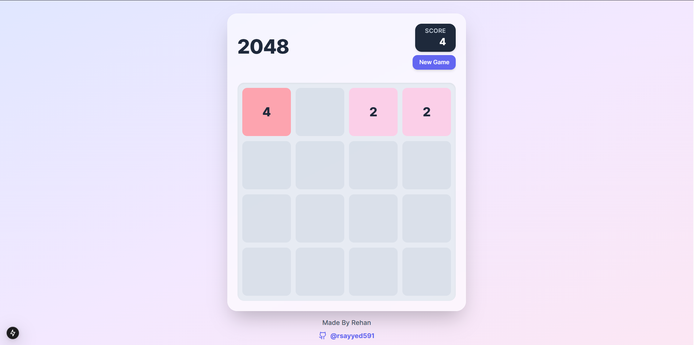
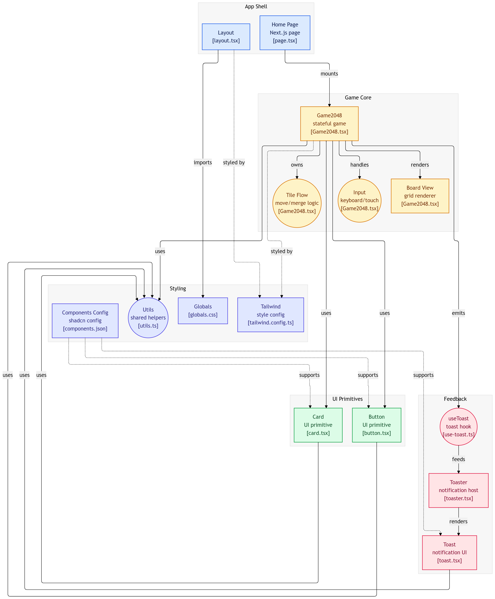

# 🎮 Next2048

[](https://gameof2048.vercel.app)
[](#)
[](#)
[](#)
[](LICENSE)

> **"Simple rules. Endless strategy."**

Next2048 is a modern implementation of the classic **2048 puzzle game**, built with **Next.js**, **TypeScript**, and **Tailwind CSS**. The project recreates the original gameplay while demonstrating efficient state management, immutable updates, and responsive UI design.

---

## 🌐 Live Demo

**Play Now:** https://gameof2048.vercel.app

---

# 📖 About

Next2048 is a browser-based puzzle game where players combine numbered tiles by sliding them across a 4×4 grid. Matching tiles merge together, increasing the score while gradually working toward the legendary **2048 tile**.

Although the gameplay appears simple, implementing the merge mechanics requires careful handling of matrix transformations, collision rules, random tile generation, keyboard events, and immutable state updates.

---

# ✨ Features

| Module                 | Features                                                                     |
| ---------------------- | ---------------------------------------------------------------------------- |
| 🎮 **Gameplay**        | Original 2048 mechanics, Random tile generation, Restart game                |
| 🧠 **Game Logic**      | Matrix transformations, Tile merging, Collision detection, Single-merge rule |
| ⌨️ **Controls**        | Arrow Keys, WASD Support, Touch Controls                                     |
| 📊 **Game State**      | Live Score, Best Score, Win Detection, Game Over Detection                   |
| 🎨 **User Experience** | Responsive Design, Smooth Animations, Toast Notifications                    |
| ⚡ **Performance**      | TypeScript, Immutable State Updates, Optimized React Rendering               |

---

# 🖥️ User Interface

The interface is designed to closely resemble the classic 2048 experience while using modern UI components and responsive layouts.

<div align="center">



<br><br>


</div>

---

# 🏗️ System Architecture

The application follows a simple component-driven architecture where the UI reacts entirely to immutable game state updates.

<div align="center">



</div>

### Game Flow

```text
Keyboard / Touch Input
          │
          ▼
Movement Handler
          │
          ▼
Grid Transformation
(Filter Empty Tiles)
          │
          ▼
Tile Merge Algorithm
          │
          ▼
Spawn Random Tile
          │
          ▼
Score Calculation
          │
          ▼
React State Update
          │
          ▼
UI Re-render
```

### Architecture Highlights

* **Next.js App Router** powers the application.
* **Game2048.tsx** contains the primary game engine and rendering logic.
* **React State** manages the complete game board.
* **Toast Hooks** provide victory and game-over notifications.
* **shadcn/ui** components create a clean, modern interface.

---

# 🛠️ Technology Stack

| Category      | Technology   |
| ------------- | ------------ |
| Framework     | Next.js 14   |
| Language      | TypeScript   |
| UI Library    | React        |
| Styling       | Tailwind CSS |
| Components    | shadcn/ui    |
| Notifications | React Toast  |
| Deployment    | Vercel       |

---

# 📂 Project Structure

```text
src/
├── app/
│   ├── layout.tsx
│   ├── page.tsx
│   └── globals.css
│
├── components/
│   ├── Game2048.tsx
│   └── ui/
│
├── hooks/
│   └── use-toast.ts
│
├── lib/
│   └── utils.ts
│
public/
├── hero.png
├── architecture.png
├── image.png
└── image1.png
```

---

# 🚀 Getting Started

## Prerequisites

* Node.js **18+**
* npm

---

## Clone Repository

```bash
git clone https://github.com/rsayyed591/Next2048.git

cd Next2048
```

---

## Install Dependencies

```bash
npm install
```

---

## Start Development Server

```bash
npm run dev
```

Visit:

```
http://localhost:3000
```

---

# 🎮 Controls

| Input          | Action               |
| -------------- | -------------------- |
| ⬅️             | Move Left            |
| ➡️             | Move Right           |
| ⬆️             | Move Up              |
| ⬇️             | Move Down            |
| W A S D        | Alternative Controls |
| Restart Button | Start New Game       |

---

# 💡 Engineering Challenges

One of the most challenging aspects of implementing 2048 is ensuring that tiles merge **only once per move**.

For example:

```
[2,2,2,2]

Correct →

[4,4,0,0]

Incorrect →

[8,0,0,0]
```

The movement algorithm performs several sequential operations:

1. Remove empty tiles.
2. Merge adjacent equal values.
3. Prevent duplicate merges.
4. Shift remaining tiles.
5. Spawn a random tile.
6. Update score.
7. Detect win or game-over conditions.

---

# 🗺️ Roadmap

* [ ] Undo Move
* [ ] Move History
* [ ] High Score Persistence
* [ ] Sound Effects
* [ ] Difficulty Modes
* [ ] Custom Board Sizes
* [ ] Themes
* [ ] Multiplayer Challenge Mode

---

# 🤝 Contributing

Contributions are welcome.

1. Fork the repository.
2. Create a feature branch.

```bash
git checkout -b feature/amazing-feature
```

3. Commit your changes.

```bash
git commit -m "feat: add amazing feature"
```

4. Push your branch.

```bash
git push origin feature/amazing-feature
```

5. Open a Pull Request.

---

# 👨‍💻 Author

### Rehan Sayyed

* 🌐 Portfolio: https://iamrehan.dev
* GitHub: https://github.com/rsayyed591
* LinkedIn: https://linkedin.com/in/rehan42

---

# 📄 License

This project is licensed under the **MIT License**.

See the **LICENSE** file for more information.

---

<div align="center">

### ⭐ Enjoying Next2048?

If you enjoyed playing the game or found the implementation useful, consider giving the repository a **star**.

Made with ❤️ by **Rehan Sayyed**

</div>